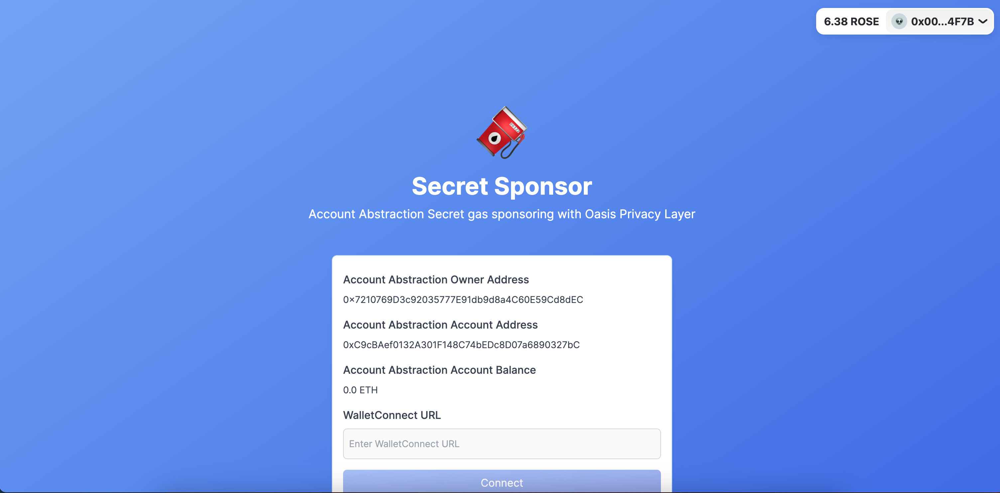

# Secret Sponsor

Account Abstraction Secret Gas Sponsoring with Oasis Privacy Layer.

## Problem Statement

Ensuring user privacy can be a complex challenge both technically and from a regulatory standpoint. Excessive privacy provisions can sometimes inadvertently enable undesirable activities such as money laundering. Consequently, smaller users find it difficult to maintain an optimal level of privacy.

## Solution & Benefits:

Secret Sponsor offers a mechanism for anonymous gas-sponsoring, incorporating account abstraction and the Oasis Privacy Layer. Users can:

- Initiate encrypted funding transactions in Sapphire.
- Bridge these funds to the Goerli account abstraction paymaster.
- Execute transactions without incurring gas fees.

Moreover, since only gas-sponsoring is involved, it's challenging to link it with malicious activities like money laundering. This setup also holds potential for NFT artists, allowing them to curate anonymous collections while retaining their anonymity.

## Technical Overview:

We've implemented a funding manager within Sapphire using the Oasis Privacy Layer. Users can carry out encrypted privacy-funding transactions, which are then synchronized to the Goerli paymaster. In addition, we have set up the Account Abstraction infrastructure on the Goerli network, utilizing the secret fund for transactions.

### Deployed Addresses

#### OPLAccountAbstractionPaymaster

https://goerli.etherscan.io/address/0xA4D01F4F04D6A62990CD56A09a1cc10568d966fE

##### Account Abstrasction Tx

https://www.jiffyscan.xyz/userOpHash/0xf0d04b8e23a15dc5322bde4cce6c6da980e16fb5884e46d72f6065c3f2dbd307?network=goerli

#### OPLAccountAbstractionEnclave

https://testnet.explorer.sapphire.oasis.dev/address/0xe976D36a90fAE9E590f17F28357d7EDBC729d0dc

##### Fund Tx

https://testnet.explorer.sapphire.oasis.dev/tx/0x8bee73d024663c416897fa869b222690936478aba4d7c1229565cfac4085ffd7

## Future Roadmap

Although the funding transaction inputs are encrypted via Sapphire, there is room to enhance the pooling and synchronization mechanisms to fortify user-privacy. Our current focus is on a Proof of Concept (PoC) for secret funding with the Oasis Privacy layer, but our vision extends to developing and refining the infrastructure further.
